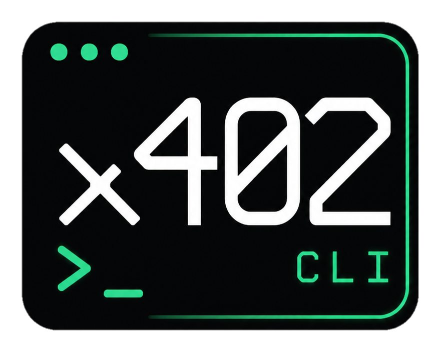

<p align="center">
  
</p>

<h1 align="center">x402 CLI</h1>

<p align="center">
  <strong>Terminal gateway for x402-powered APIs on Base</strong>
</p>

<p align="center">
  <a href="https://x402cli.xyz">Website</a> ·
  <a href="https://x402cli.xyz/docs">Docs</a> ·
  <a href="https://api.x402cli.xyz">Demo API</a> ·
  <a href="https://x.com/x402cli">@x402cli</a> ·
  <a href="https://github.com/louismaxdubois/x402cli">GitHub</a>
</p>

<p align="center">
  
  
  
  
  <a href="https://x.com/x402cli"></a>
</p>

---

## Follow updates on X

**Project progress, releases, and announcements are posted on X:**

### 👉 [https://x.com/x402cli](https://x.com/x402cli) · **@x402cli**

Follow **[@x402cli](https://x.com/x402cli)** for:

- Development updates and roadmap progress
- New features on [x402cli.xyz](https://x402cli.xyz)
- CLI package news when available
- Registry and API ecosystem updates

GitHub Issues are for bugs and feature requests. **Day-to-day progress lives on X.**

---

## What is this?

**x402 CLI** is an experimental developer tool for exploring **HTTP 402 Payment Required** flows, **USDC** micropayments on **Base**, and pay-per-request APIs for developers and AI agents.

The **live product** is at **[x402cli.xyz](https://x402cli.xyz)**.  
This repository is the **official public hub** — documentation, status, roadmap, and community.

**Follow [@x402cli on X](https://x.com/x402cli) for development updates and announcements.**

> **Website source (HTML/CSS/JS) is not published here** — only docs and project files. The live site is the source of truth.

> **Disclaimer:** Not affiliated with Coinbase, Base, Coinbase Developer Platform, or any official x402 organization. [Full disclaimer →](docs/DISCLAIMER.md)

---

## Does it work?

**Partially.** See [STATUS.md](STATUS.md) for the honest breakdown.

| Component | Status |
|-----------|--------|
| Website | ✅ Live |
| Scanner | 🟡 Mock (frontend) |
| CLI package | ⏳ Planned |
| Demo API | ✅ HTTP 402 at api.x402cli.xyz |
| USDC payments | ❌ Not yet |

---

## Documentation

| Doc | Description |
|-----|-------------|
| [Follow on X](SOCIAL.md) | **Project updates @x402cli** |
| [Introduction](docs/INTRODUCTION.md) | What is x402 CLI |
| [Commands](docs/COMMANDS.md) | Planned CLI reference |
| [API](docs/API.md) | api.x402cli.xyz endpoints |
| [Architecture](docs/ARCHITECTURE.md) | System overview |
| [Roadmap](docs/ROADMAP.md) | Development phases |
| [FAQ](docs/FAQ.md) | Common questions |
| [Disclaimer](docs/DISCLAIMER.md) | Legal / affiliation notice |
| [Changelog](CHANGELOG.md) | Version history |
| [Contributing](CONTRIBUTING.md) | How to contribute |
| [Security](SECURITY.md) | Report vulnerabilities |

---

## Planned CLI

```bash
x402cli scan <url>
x402cli inspect <url>
x402cli registry
x402cli demo
```

Details: [docs/COMMANDS.md](docs/COMMANDS.md)

---

## Community & links

| Channel | Link | Purpose |
|---------|------|---------|
| **X (updates)** | [**@x402cli**](https://x.com/x402cli) | **Follow here for project progress** |
| Website | [x402cli.xyz](https://x402cli.xyz) | Live product |
| Demo API | [api.x402cli.xyz](https://api.x402cli.xyz) | HTTP 402 demo endpoints |
| GitHub | [louismaxdubois/x402cli](https://github.com/louismaxdubois/x402cli) | Docs, issues, contributions |

---

## License

[MIT License](LICENSE)

<p align="center"><sub>Independent experimental project · Not affiliated with Coinbase or Base</sub></p>
